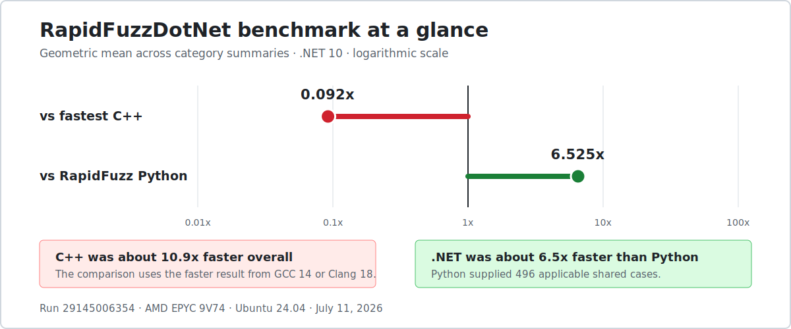
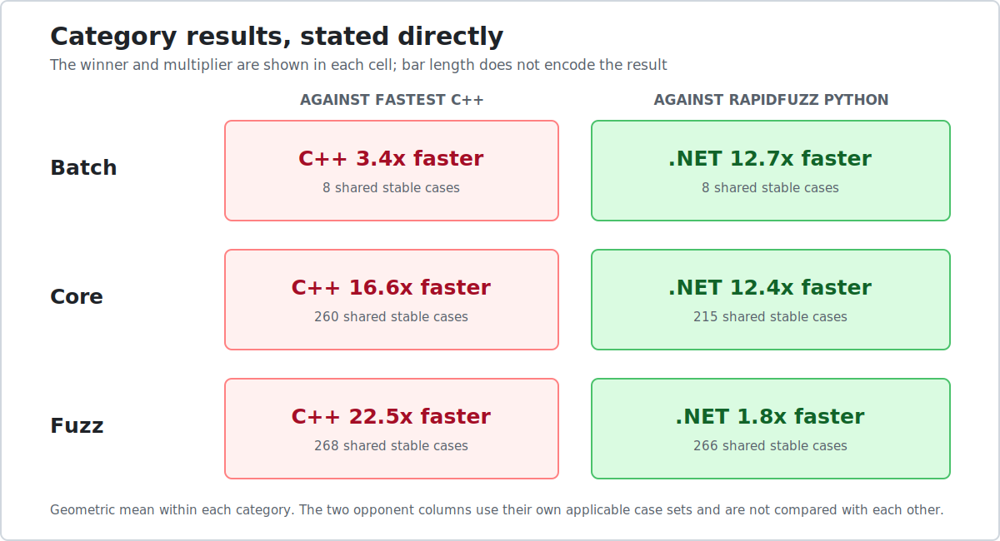
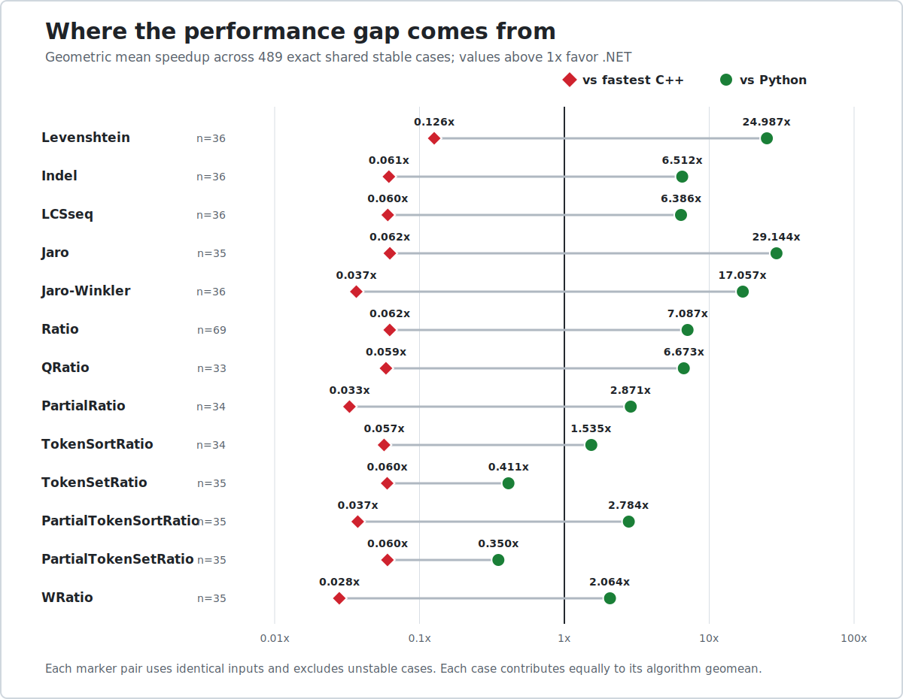
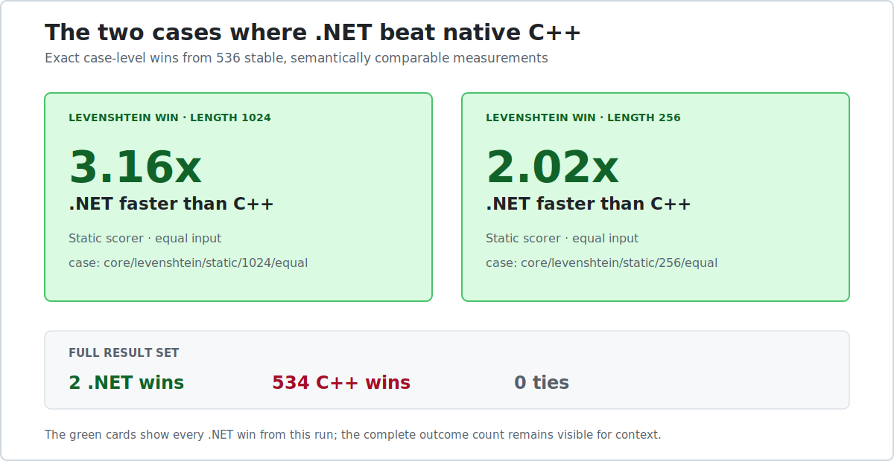

# RapidFuzzDotNet

RapidFuzzDotNet brings the algorithms and scoring model of [RapidFuzz](https://github.com/rapidfuzz/RapidFuzz) to managed .NET. It targets `net8.0` and `net10.0`, has no runtime package dependencies, and ships portable symbols with Source Link.

This project exists because [Max Bachmann](https://github.com/maxbachmann) did the difficult work first. He created RapidFuzz, developed its core algorithms, shaped its API, and backed the implementation with an unusually careful body of tests and benchmarks. That combination of mathematical judgment, practical performance work, and attention to edge cases is what made RapidFuzz a reference in fuzzy matching. RapidFuzzDotNet would have no foundation without it.

Our role is deliberately narrower: we are implementers. We translate Max's work into managed C#, adapt its memory and SIMD strategies to .NET, verify the results against his upstream project, and package the implementation for NuGet. We do not claim authorship of the algorithms, scoring model, or original design. Credit for those belongs to Max Bachmann.

Version `1.0.0-beta.2` tracks [`rapidfuzz-cpp`](https://github.com/rapidfuzz/rapidfuzz-cpp) commit `b5830af53bd1b3c7460a8de1e9f7095df99b3470`.

## Install

```powershell
dotnet add package RapidFuzzDotNet --version 1.0.0-beta.2
```

## Start Here

```csharp
using RapidFuzz;
using RapidFuzz.Distance;

double ratio = Fuzz.Ratio("this is a test", "this is a test!");
double partial = Fuzz.PartialRatio("new york mets", "the new york mets roster");
double weighted = Fuzz.WRatio("fuzzy wuzzy was a bear", "wuzzy fuzzy bear");
int distance = Levenshtein.Distance("kitten", "sitting");
double similarity = JaroWinkler.Similarity("martha", "marhta");
```

The fuzzy scorers return values from `0` to `100`. Distance algorithms expose raw distance, similarity, normalized distance, and normalized similarity where those measures apply.

## Available Algorithms

The distance namespace includes Levenshtein, Indel, LCS sequence, Hamming, optimal string alignment, Damerau-Levenshtein, Jaro, Jaro-Winkler, prefix, and postfix comparisons.

`Fuzz` includes ratio, partial ratio, token sort, token set, token ratio, partial token variants, weighted ratio, and quick ratio. Token scorers are text-specific because their behavior depends on whitespace tokenization. The remaining algorithms also work with generic sequences.

## Cutoffs And Hints

A score cutoff lets an algorithm stop once the requested result can no longer be reached. Distance methods return `scoreCutoff + 1` when the true distance exceeds the cutoff. Similarity methods return zero when the result falls below it.

A score hint can select a faster path. It never changes the answer.

```csharp
using RapidFuzz.Distance;

int distance = Levenshtein.Distance(
    "implementation",
    "implemantation",
    scoreCutoff: 3,
    scoreHint: 1);
```

## Generic Sequences

Generic overloads accept `ReadOnlySpan<T>` and compare elements by equality.

```csharp
using RapidFuzz;
using RapidFuzz.Distance;

int[] source = [1, 2, 3, 4];
int[] target = [1, 3, 2, 4];

int distance = DamerauLevenshtein.Distance<int>(source, target);
double score = Fuzz.QRatio<int>(source, target);
EditOperations edits = Levenshtein.Editops<int>(source, target);
int[] transformed = edits.ApplyTo<int>(source, target);
```

Different source and target element types use an explicit comparer. Comparisons always run in source-to-target orientation, so the comparer does not need to be symmetric.

```csharp
using RapidFuzz;
using RapidFuzz.Distance;

byte[] source = [1, 2, 3];
int[] target = [1, 3, 2];
ISequenceEqualityComparer<byte, int> comparer = new ByteIntComparer();

int distance = Levenshtein.Distance(source, target, comparer);
double score = Fuzz.Ratio(source, target, comparer);

sealed class ByteIntComparer : ISequenceEqualityComparer<byte, int>
{
    public bool Equals(byte left, int right) => left == right;
}
```

Cross-type comparisons are available in the static, cached, edit-operation, and generic multi APIs. `ApplyTo<T>` remains single-type because a cross-type edit script has no unambiguous result element type.

## Cached Scorers

Cached scorers store one source and reuse its precomputed state across many comparisons. Generic cached constructors make a defensive copy, so changing the original array later does not alter the scorer.

```csharp
using RapidFuzz;
using RapidFuzz.Distance;

CachedRatio cachedRatio = new("fuzzy wuzzy was a bear");
double ratio = cachedRatio.Similarity("wuzzy fuzzy was a bear");

CachedLevenshtein<int> cachedDistance = new([1, 2, 3, 4]);
int distance = cachedDistance.Distance([1, 3, 2, 4]);
```

Cached variants cover the distance family and the text scorers, including partial and token-based comparisons.

## Multi Scorers

Multi scorers compare one target with a batch of stored sources. Short patterns can use portable `Vector<ulong>` lanes when the runtime provides hardware acceleration. Longer patterns and partial batches use cached scalar paths.

```csharp
using RapidFuzz.Distance.Experimental;
using RapidFuzz.Experimental;

MultiLevenshtein multiDistance = new(["kitten", "sitting", "smitten"]);
int[] distances = multiDistance.Distances("sitting");

MultiQRatio<int> multiRatio = new([[1, 2, 3], [1, 3, 2]]);
double[] scores = multiRatio.Similarities([1, 2, 4]);
```

The multi APIs live under `Experimental`. They are mutable while patterns are being inserted and do not promise thread safety.

## Edit Operations

Levenshtein, Indel, LCS sequence, and Hamming can produce edit operations and opcodes. Both representations support slicing with bounded positive steps and Python-style negative indices. Applying a script reconstructs the destination sequence.

```csharp
using RapidFuzz.Distance;

EditOperations edits = Levenshtein.Editops("qabxcd", "abycdf");
EditOperations middle = edits.Slice(1, -1, 1);
EditOperations withoutMiddle = edits.RemoveSlice(1, -1, 1);
string reconstructed = edits.ApplyTo("qabxcd", "abycdf");
```

## Process

`Process` provides ranked lookup and score matrices without adding a separate search dependency. Its public surface includes `Extract`, `ExtractIter`, `ExtractOne`, `Cdist`, and `Cpdist`.

```csharp
using RapidFuzz;

string[] choices = ["new york mets", "new york yankees", "atlanta braves"];
ExtractedResult<string>? match = Process.ExtractOne("new york mets", choices);
double[,] scores = Process.Cdist(["new york mets"], choices, scorer: Fuzz.Ratio);
```

## Managed Implementation

The production assembly is fully managed. It uses no native memory access, native binaries, or runtime package dependencies. Small working buffers use stack storage; larger temporary buffers are rented and returned through `ArrayPool<T>`. Batch paths use portable `System.Numerics.Vector<T>` rather than architecture-specific intrinsics.

These are .NET implementation choices, not new algorithmic claims. The performance strategy still follows the standard set by Max's `rapidfuzz-cpp` work.

## Upstream Tracking

The repository carries an auditor that checks the pinned upstream SHA, public algorithms, named fixtures, fuzz targets, and benchmark registrations. The current baseline covers 64 upstream fixtures, nine fuzz targets, and 77 benchmark registrations. Deterministic fuzzing and independent reference implementations exercise strings, bytes, integers, record structs, cached scorers, multi scorers, slices, and cross-type comparisons.

That machinery is here for one reason: a port should earn trust by agreeing with its source, not by borrowing the source project's reputation.

## Benchmarks

The first reviewed cross-language run compared `net10.0` with the fastest result from the original C++ benchmarks compiled by GCC 14 and Clang 18, plus RapidFuzz Python built from source. Every runtime used the same deterministic ASCII corpus on one Ubuntu runner. Results were checked before timing, and cases with more than 10% variation were excluded.

Every chart names the winner and measured multiplier directly. C++ and Python are shown as separate baselines, so there are no reciprocal speedups or connected scales to interpret. C++ and .NET covered 544 cases; 536 met the stability rule for direct comparison. Python supplied results for 496 applicable shared cases.







The algorithm view uses 489 exact shared stable cases. In that subset, .NET beat Python on every algorithm aggregate except `TokenSetRatio` and `PartialTokenSetRatio`.



These numbers are not a victory lap. C++ won nearly every direct comparison. .NET did well against the Python binding and found two Levenshtein wins, but the native implementation remains the performance target.

Run [`29145006354`](https://github.com/Mauriciog87/RapidFuzzDotNet/actions/runs/29145006354) completed on July 11, 2026, on an AMD EPYC 9V74 runner with four logical CPUs visible; timed processes were pinned to one core. It used .NET commit `25cf5ea`, `rapidfuzz-cpp` commit `b5830af`, RapidFuzz Python commit `e891fed`, and corpus SHA-256 `3353b58f031a24ba87dbc1798edaaf4451797e49878d3d08c15ecf3c6714052c`. The [raw artifact](https://github.com/Mauriciog87/RapidFuzzDotNet/actions/runs/29145006354/artifacts/8249111193) contains the JSON, CSV, HTML, and original logs.

The benchmark shapes and algorithms come from Max Bachmann's original RapidFuzz work. This project supplied the managed port and the cross-language harness. The complete benchmark implementation remains on the [`codex/benchmarks-official-comparison`](https://github.com/Mauriciog87/RapidFuzzDotNet/tree/codex/benchmarks-official-comparison) branch.

## Build And Test

```powershell
dotnet restore RapidFuzzDotNet.slnx
dotnet format RapidFuzzDotNet.slnx --verify-no-changes
dotnet build RapidFuzzDotNet.slnx -c Release
dotnet test RapidFuzzDotNet.slnx -c Release --no-build
```

## Attribution

RapidFuzz and `rapidfuzz-cpp` are the work of Max Bachmann. His combination of algorithmic depth, disciplined optimization, and exhaustive validation is the reason this port can exist at all. When RapidFuzzDotNet is useful, fast, or correct, the original credit belongs with him.

RapidFuzzDotNet is an independent managed implementation of that work. We translate, test, package, and maintain the .NET code. Nothing more is being claimed.

The project is distributed under the MIT license. The package includes `LICENSE` and `NOTICE` with its source provenance and pinned upstream revision.
